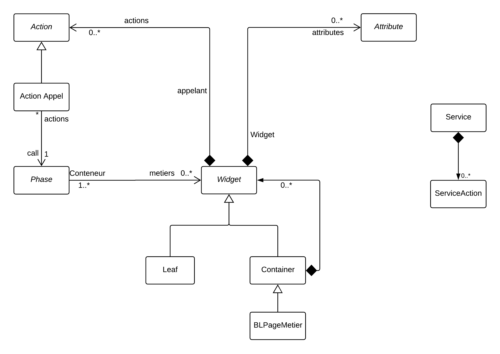

# Casino

Master: 

This repository contains the main packages of Casino.
It includes:

- A meta-model to represent web site
- An Importer for this meta-model
- An Exporter for this meta-model
- A Specific Importer for JAVA
- A Specific Exporter to Angular

It also contains some specific package for a company (but you don't need to know)

## Installation

In Iceberg, BaselineOfBLToolkit load.

## Meta-Model

The current meta-model is

## Process

